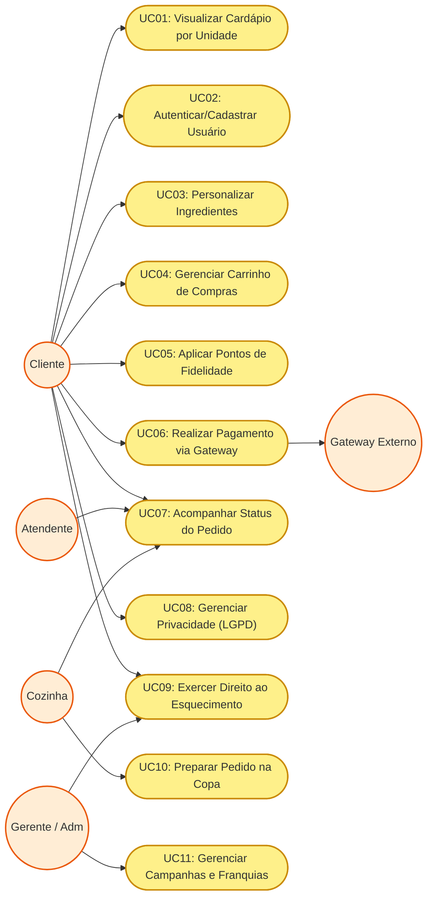
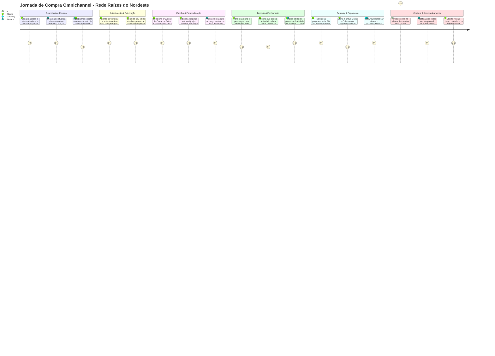

# RELATÓRIO TÉCNICO E DE DESIGN SYSTEM: REDE RAÍZES DO NORDESTE
## Disciplina: Projeto Multidisciplinar – Trilha Front-End
## Curso: Tecnologia em Análise e Desenvolvimento de Sistemas

---

## SUMÁRIO

1. [INTRODUÇÃO E OBJETIVOS](#1-introdução-e-objetivos)
2. [ANÁLISE E REQUISITOS DO SISTEMA](#2-análise-e-requisitos-do-sistema)
   - 2.1. [Requisitos Funcionais (RF)](#21-requisitos-funcionais-rf)
   - 2.2. [Requisitos Não Funcionais (RNF)](#22-requisitos-não-funcionais-rnf)
3. [MODELAGEM E ARQUITETURA DA INTERFACE](#3-modelagem-e-arquitetura-da-interface)
   - 3.1. [Diagrama de Casos de Uso](#31-diagrama-de-casos-de-uso)
   - 3.2. [Descrição Detalhada de Feature (Realizar Pagamento)](#32-descrição-detalhada-de-feature-realizar-pagamento)
   - 3.3. [Diagrama da Jornada do Usuário](#33-diagrama-da-jornada-do-usuário)
4. [WIREFRAME DE BAIXA FIDELIDADE (MULTICANALIDADE)](#4-wireframe-de-baixa-fidelidade-multicanalidade)
   - 4.1. [Layout Canal Web (Desktop)](#41-layout-canal-web-desktop)
   - 4.2. [Layout Canal Totem (Kiosk Autoatendimento)](#42-layout-canal-totem-kiosk-autoatendimento)
   - 4.3. [Layout Canal App (Mobile/Smartphone)](#43-layout-canal-app-mobilesmartphone)
5. [LGPD E PRIVACIDADE DA INTERFACE](#5-lgpd-e-privacidade-da-interface)
   - 5.1. [Transparência e Consentimento Granular](#51-transparência-e-consentimento-granular)
   - 5.2. [Direitos do Titular no Frontend (Artigo 18 LGPD)](#52-direitos-do-titular-no-frontend-artigo-18-lgpd)
   - 5.3. [Salvaguardas Técnicas e Direito ao Esquecimento](#53-salvaguardas-técnicas-e-direito-ao-esquecimento)
6. [ENTREGA TÉCNICA E ARQUITETURA DE SOFTWARE](#6-entrega-técnica-e-arquitetura-de-software)
   - 6.1. [Tecnologias Adotadas](#61-tecnologias-adotadas)
   - 6.2. [Estrutura do Repositório](#62-estrutura-do-repositório)
7. [PLANO E CENÁRIOS DE TESTE DA INTERFACE](#7-plano-e-cenários-de-teste-da-interface)
   - 7.1. [Estratégia de Validação](#71-estratégia-de-validação)
   - 7.2. [Tabela de Cenários de Teste (Mínimo de 10 Cenários)](#72-tabela-de-cenários-de-teste-mínimo-de-10-cenários)
8. [CONCLUSÃO](#8-conclusão)
9. [DECLARAÇÃO DE USO DE INTELIGÊNCIA ARTIFICIAL](#9-declaração-de-uso-de-inteligência-artificil)
10. [REFERÊNCIAS BIBLIOGRÁFICAS (ABNT)](#10-referências-bibliográficas-abnt)

---

## 1. INTRODUÇÃO E OBJETIVOS

A expansão ordenada e escalável de redes de lanchonetes regionalizadas exige soluções digitais que não apenas repliquem as transações de compra fisicamente consolidadas, mas que também capturem a identidade cultural da marca e forneçam uma experiência consistente através de múltiplos canais de interação (omnichannel). Este projeto multidisciplinar documenta e desenvolve a interface e fluxo de atendimento para a **Rede Raízes do Nordeste**, uma franquia especializada na culinária nordestina, em especial o cuscuz temperado e recheado.

O objetivo deste projeto consiste em conceber, justificar e codificar um ecossistema front-end unificado voltado a suportar três canais de atendimento essenciais no varejo moderno:
- **Web (Desktop/Mobile):** Focado no e-commerce tradicional de delivery e agendamento remoto de refeições.
- **Totem (Kiosk):** Desenvolvido com ergonomia própria para terminais físicos de autoatendimento localizados no interior das lojas físicas.
- **App (Mobile Nativo/Smartphone Mockup):** Projetado sob a ótica da conveniência e agilidade móvel, integrado a um programa robusto de fidelidade e cashback.

O diferencial do projeto assenta-se na maturidade técnica de sua arquitetura: a aplicação foi codificada em **React (Vite) com JavaScript ES6+ e CSS customizado**, operando com dados mockados dinâmicos e controle de estado global reativo. A solução integra de forma explícita regras de fidelização de clientes, simulação realística de gateway financeiro de pagamento externo e uma central granular de privacidade em estrita conformidade com a Lei Geral de Proteção de Dados (LGPD - Lei nº 13.709/2018).

---

## 2. ANÁLISE E REQUISITOS DO SISTEMA

### 2.1. Requisitos Funcionais (RF)

Os requisitos funcionais detalham os serviços e fluxos operacionais que a interface torna acessíveis ao usuário final.

| Código | Descrição Curta | Detalhamento Técnico da Experiência do Usuário |
| :--- | :--- | :--- |
| **RF-01** | Cadastro e Autenticação | Formulário reativo para login/cadastro (`AuthModal`). Salva os dados localmente para manter a sessão ativa, atribuindo pontuação de fidelidade mockada imediata. |
| **RF-02** | Seleção Dinâmica de Unidade | Localização de quiosques e alteração automática de cardápio baseado na unidade ativa (`FranchiseSection` e `MenuSection`), adequando preços e disponibilidade regional. |
| **RF-03** | Customização de Ingredientes | Customização de cuscuz estilo "Five Guys" (`IngredientsCustomizer`), permitindo ao usuário selecionar adicionais com recálculo instantâneo do valor do item no carrinho. |
| **RF-04** | Fluxo de Pedido Completo | Adição de itens ao carrinho (`CartDrawer`), ajuste de quantidades, fechamento de pedido (`CheckoutModal`) e escolha entre Delivery em domicílio ou Retirada na mesa da loja física. |
| **RF-05** | Programa de Fidelização | Integração de pontos de fidelidade acumulados. Permite a dedução de pontos no checkout como desconto real (`1 ponto = R$ 1,00`), além de painel de controle de cashback (`FidelityModal`). |
| **RF-06** | Campanha Promocional | Seção dedicada ao destaque de combos promocionais regionais e kits familiares (`PromoSection`), integrando-os com adição rápida ao carrinho. |
| **RF-07** | Integração com Gateway Externo | Representação visual do fluxo de envio do pagamento e retorno do status em sandbox financeiro simulado ("RaízesPay") via PIX (QR Code e Copia/Cole) ou Cartão de Crédito. |
| **RF-08** | Rastreamento do Pedido | Acompanhamento do status de preparação na cozinha em tempo real (`OrderTracker`), com avanço reativo em 4 estágios (`recebido` ➔ `preparando` ➔ `pronto` ➔ `entregue`). |
| **RF-09** | Banner de Consentimento LGPD | Banner inicial obstrutivo parcial (`LgpdBanner`) contendo opções explícitas de Aceitar, Recusar ou Customizar os tipos de cookies de navegação e tratamento de dados. |
| **RF-10** | Central de Privacidade LGPD | Modal para gerenciamento de direitos (`PrivacyCenterModal`), possibilitando consentimento granular de cookies, exportação de dados (JSON) e Exercício do Direito ao Esquecimento. |

### 2.2. Requisitos Não Funcionais (RNF)

Os requisitos não funcionais especificam critérios técnicos que qualificam o comportamento e a restrição de design da solução desenvolvida.

*   **RNF-01: Abordagem Mobile-First e Responsividade:** A interface foi concebida utilizando prioritariamente estruturas flexíveis voltadas para telas móveis (360px a 480px) e, subsequentemente, expandida via media-queries CSS para resoluções de desktop (1024px a 1440px). Em ambiente desktop, o canal móvel é demonstrado através de uma moldura hiper-realista de smartphone de última geração.
*   **RNF-02: Alta Performance de Carregamento:** Redução de dependências externas complexas. Uso de pacotes leves (`lucide-react` para vetores SVG, `framer-motion` para animações fluidas baseadas em GPU física). Imagens otimizadas em formato de última geração (`.webp`).
*   **RNF-03: Robustez de Estado Global:** Gerenciamento centralizado de fluxo de dados por meio do padrão Context API do React (`AppContext.jsx`), prevenindo "prop drilling" e assegurando que modificações em fidelidade ou carrinho reflitam-se instantaneamente em todas as telas e canais simulados.
*   **RNF-04: Acessibilidade Semântica e SEO:** Utilização estrita de tags HTML5 estruturantes (`<header>`, `<nav>`, `<main>`, `<section>`, `<footer>`), propriedades de acessibilidade e uma hierarquia consistente de cabeçalhos (`<h1>` único por canal, seguido por `<h2>` e `<h3>`).

---

## 3. MODELAGEM E ARQUITETURA DA INTERFACE

### 3.1. Diagrama de Casos de Uso

A lógica operacional e a interação dos atores da Rede Raízes do Nordeste são modeladas a seguir através da notação Mermaid:



### 3.2. Descrição Detalhada de Feature (Realizar Pagamento)

Abaixo, detalha-se o caso de uso crítico **UC06: Realizar Pagamento via Gateway** para demonstrar como o sistema reativo lida com processamento seguro externo de forma conceitual na interface.

*   **Atores Principais:** Cliente, Gateway de Pagamento Externo (RaízesPay).
*   **Pré-condições:** O Cliente deve possuir ao menos um item válido no carrinho de compras e ter preenchido com sucesso os dados de envio (Delivery ou Mesa/Quiosque) na Etapa 1 do checkout.
*   **Fluxo Principal:**
    1.  O usuário, na Etapa 3 do `CheckoutModal`, escolhe o método de pagamento externo: **PIX Instantâneo** ou **Cartão de Crédito**.
    2.  Caso escolha **PIX**: O sistema renderiza um QR Code dinâmico fictício e disponibiliza um botão para copiar a chave Pix Copia e Cole para a área de transferência.
    3.  Caso escolha **Cartão de Crédito**: O usuário preenche os campos do formulário (Nome, Número, Validade, CVV). O sistema realiza a validação de formato e comprimento em tempo real.
    4.  O usuário clica no botão "Enviar e Pagar via Gateway".
    5.  A interface intercepta a ação e exibe uma tela sobreposta (Overlay) com indicador de carregamento animado identificando a transação externa ativa: `🔒 GATEWAY SEGURO EXTERNO: RAIZESPAY`.
    6.  Durante 2.5 segundos, a interface bloqueia novas interações físicas do usuário para simular de forma fiel a autorização bancária e a comunicação do protocolo.
    7.  Após o retorno positivo do simulador, o painel muda visualmente para um estado de Sucesso (`PAGAMENTO AUTORIZADO!`), gerando um feedback auditivo/visual claro.
    8.  O carrinho é limpo automaticamente, os pontos de fidelidade gerados na compra (10% de cashback) são computados na conta do usuário no local storage, o checkout é encerrado e o painel de Acompanhamento do Pedido (`OrderTracker`) é iniciado.
*   **Fluxo Alternativo (Tratamento de Erros / Exceção):**
    *   *Se dados do cartão inválidos:* O formulário exibe mensagens de erro em vermelho abaixo de cada campo específico, impedindo o envio para o gateway até a correção do preenchimento pelo usuário.
    *   *Se cookies funcionais recusados no banner da LGPD:* O usuário é notificado de que dados pessoais e de fidelidade não poderão ser salvos persistentemente no navegador. A compra avança em modo estritamente anônimo e temporário.

### 3.3. Diagrama da Jornada do Usuário

Mapeia o percurso emocional, as decisões, os estados do sistema e as interações do cliente desde o primeiro acesso até o recebimento e consumo do pedido.



---

## 4. WIREFRAME DE BAIXA FIDELIDADE (MULTICANALIDADE)

Para demonstrar a arquitetura da informação e a adaptabilidade espacial em canais físicos e virtuais, os wireframes de baixa fidelidade são ilustrados estruturalmente em formato textual estruturado.

### 4.1. Layout Canal Web (Desktop)
Foco em visualização ampla de marca, transições elegantes de conteúdo e conveniência do comércio eletrônico de entrega em domicílio.
```text
+--------------------------------------------------------------------------------------------------------+
|  [LOGO RAIZES]       Inicio    Sobre Nós    Promoções    CARDÁPIO    Quiosques    Contato   [LOGIN/CONTA] |
+--------------------------------------------------------------------------------------------------------+
|                                                                                                        |
|   HERO SECTION: "CUSCUZ COM IDENTIDADE E ARTE BRUTALISTA"                                              |
|   +-----------------------------+   +--------------------------------------------------------------+   |
|   | Textos Promocionais         |   | Imagem Destaque (Cuscuz Quentinho)                           |   |
|   | Botão: [VER CARDÁPIO AGORA] |   | Exibe borda rasgada de papel em formato SVG                  |   |
|   +-----------------------------+   +--------------------------------------------------------------+   |
|                                                                                                        |
+--------------------------------------------------------------------------------------------------------+
|   NOSSOS COMBOS PROMOCIONAIS (CAROUSEL)                                                                |
|   +---------------------------+  +---------------------------+  +---------------------------+          |
|   | Combo Arretado Supreme    |  | Banquete do Sertão        |  | Combo Cuscuz e Café       |          |
|   | [ADICIONAR POR R$ 38,00]  |  | [ADICIONAR POR R$ 68,00]  |  | [ADICIONAR POR R$ 16,00]  |          |
|   +---------------------------+  +---------------------------+  +---------------------------+          |
+--------------------------------------------------------------------------------------------------------+
|   CARDÁPIO OFICIAL DA UNIDADE: [ RECIFE ]                                                              |
|   Categorias: [Cuscuz]  [Bebidas]  [Sobremesas]  [Combos]                                              |
|   +-------------------+  +-------------------+  +-------------------+  +-------------------+           |
|   | Cuscuz Tradicional|  | Cuscuz Sertanejo  |  | Cuscuz Nordestino |  | Cuscuz Doce       |           |
|   | R$ 12,90          |  | R$ 18,90          |  | R$ 22,90          |  | R$ 14,90          |           |
|   | [Personalizar]    |  | [Personalizar]    |  | [Personalizar]    |  | [Personalizar]    |           |
|   +-------------------+  +-------------------+  +-------------------+  +-------------------+           |
+--------------------------------------------------------------------------------------------------------+
| [PRIVACIDADE LGPD BANNER: cookies funcionais, acúmulo de pontos e carrinho]  [Preferências] [Aceitar]  |
+--------------------------------------------------------------------------------------------------------+
```

### 4.2. Layout Canal Totem (Kiosk Autoatendimento)
Ergonomia focada em telas verticais de grandes proporções. Navegação otimizada para toque (Touch), remoção de seções institucionais de longo texto (Sobre Nós/Contato), foco imediato no fechamento de compra local rápida e cabeçalho fixo informando o modo Kiosk.
```text
+--------------------------------------------------------------------------------------------------------+
|  🏪 MODO TOTEM DE AUTOATENDIMENTO - LOJA RECIFE BOA VIAGEM                                             |
+--------------------------------------------------------------------------------------------------------+
|                                                                                                        |
|   FAÇA SEU PEDIDO EM POUCOS TOQUES!                                                                    |
|                                                                                                        |
|   CATEGORIAS:                                                                                          |
|   +--------------------+  +--------------------+  +--------------------+  +--------------------+       |
|   |  🌽 CUSCUZ RECHEADO |  |  ☕ BEBIDAS QUENTES |  |  🥤 BEBIDAS GELADAS |  |  🍮 SOBREMESAS      |       |
|   +--------------------+  +--------------------+  +--------------------+  +--------------------+       |
|                                                                                                        |
|   SELECIONE SEUS ITENS DO CARDÁPIO:                                                                    |
|   +------------------------------------+      +------------------------------------+                   |
|   | Cuscuz Arretado (Carne Sol)        |      | Cuscuz Cangaceiro (Queijo + Ovo)   |                   |
|   | R$ 24,90                           |      | R$ 19,90                           |                   |
|   | [ TOQUE PARA ADICIONAR E CUSTOMIZAR]      | [ TOQUE PARA ADICIONAR E CUSTOMIZAR]                   |
|   +------------------------------------+      +------------------------------------+                   |
|                                                                                                        |
|   +------------------------------------------------------------------------------------------------+   |
|   | RESUMO DO SEU CARRINHO LOCAL:                                                                  |   |
|   | 1x Cuscuz Arretado (+Queijo Coalho Adicional) -------------------------------------- R$ 28,90     |   |
|   |                                                                                [ FINALIZAR ➔ ] |   |
|   +------------------------------------------------------------------------------------------------+   |
+--------------------------------------------------------------------------------------------------------+
```

### 4.3. Layout Canal App (Mobile/Smartphone)
Projetado sob a ótica da portabilidade. Menu sanduíche, grids flexíveis de uma ou duas colunas de produtos, botão de carrinho flutuante na parte inferior e mockup físico renderizado em tela em alta definição.
```text
+----------------------------------------+
| [MOCKUP DE SMARTPHONE HIGH-PREMIUM]    |
| +------------------------------------+ |
| |  [=] [LOGO APP RAIZES]       [💰150] | |
| +------------------------------------+ |
| | 🏪 Unidade Recifense   (Alterar)   | |
| +------------------------------------+ |
| |  O CUSCUZ MAIS ARRETADO DA CIDADE   | |
| |  +-------------------------------+  | |
| |  | [ Adicione Adicionais Extras ]|  | |
| |  +-------------------------------+  | |
| |                                     | |
| |  CARDÁPIO DO SERTÃO:                | |
| |  +-------------------------------+  | |
| |  | Cuscuz Supreme                |  | |
| |  | Carne de Sol desfiada, queijo |  | |
| |  | coalho dourado na chapa.      |  | |
| |  | R$ 26,90      [ ADICIONAR + ] |  | |
| |  +-------------------------------+  | |
| |  | Cuscuz Simples                |  | |
| |  | Acompanha manteiga de garrafa |  | |
| |  | R$ 12,90      [ ADICIONAR + ] |  | |
| |  +-------------------------------+  | |
| |                                     | |
| |  +-------------------------------+  | |
| |  | 🛒 VER MEU CARRINHO (R$ 26,90) |  | |
| |  +-------------------------------+  | |
| +------------------------------------+ |
+----------------------------------------+
```

---

## 5. LGPD E PRIVACIDADE DA INTERFACE

A privacidade de dados pessoais e o respeito às escolhas de navegação do cliente constituem o cerne ético e regulatório da interface da Rede Raízes do Nordeste. Diferente de aplicações genéricas, o sistema implementa de forma tangível em código e componentes os princípios estipulados pela Lei Geral de Proteção de Dados (LGPD).

### 5.1. Transparência e Consentimento Granular

Logo no primeiro acesso à aplicação, um banner persistente (`LgpdBanner.jsx`) alerta de forma didática sobre o uso de dados. Em vez de forçar um aceite cego, a interface oferece três botões com pesos visuais equilibrados: "Aceitar Todos", "Recusar" e "Preferências".
Ao selecionar "Preferências", o cliente é direcionado à **Central de Privacidade** (`PrivacyCenterModal.jsx`), que categoriza e permite a desativação granular das finalidades de cookies:
1.  **Cookies Estritamente Necessários (Essenciais):** Obrigatórios para o processamento de compras (carrinho) e controle seguro de sessão. Não podem ser desativados por critérios funcionais básicos.
2.  **Cookies Estatísticos e Desempenho:** Coleta anônima de tráfego físico. Podem ser desativados livremente.
3.  **Cookies de Marketing e Promoções:** Memorização de franquias e ativação de cupons regionais. Podem ser ativados/desativados sob critério do usuário.

### 5.2. Direitos do Titular no Frontend (Artigo 18 LGPD)

A Central de Privacidade implementa botões interativos para simular e concretizar direitos garantidos pelo Artigo 18 da LGPD:
*   **Direito de Acesso e Portabilidade:** O usuário cadastrado pode clicar em "Exportar meus dados (JSON)". O sistema gera e descarrega dinamicamente no computador do usuário um relatório oficial (`raizes_nordeste_lgpd_relatorio.json`) mapeando de forma estruturada todos os dados pessoais mantidos na sessão e no local storage (Nome, Email, histórico de pontos e cookies ativos).
*   **Direito ao Esquecimento (Eliminação de Dados):** O usuário possui acesso ao botão "Excluir meus dados". Ao ser acionado, o sistema solicita confirmação do usuário e prossegue com a eliminação total e irreversível de todas as informações pessoais do armazenamento do navegador (contas mockadas, saldo de pontos e histórico de pedidos), deslogando a sessão imediatamente.

### 5.3. Salvaguardas Técnicas e Direito ao Esquecimento

Técnicas modernas de armazenamento seguro foram aplicadas no front-end:
```javascript
const saveCookieConsent = (type) => {
  setCookieConsent(type);
  localStorage.setItem('raizes_cookie_consent', type);
  if (type === 'rejected') {
    // Purga imediata de dados do usuário em caso de revogação de consentimento
    setUser(null);
    localStorage.removeItem('raizes_user');
    localStorage.removeItem('raizes_order');
    setActiveOrder(null);
  }
};
```
O código acima ilustra a conformidade técnica: se o consentimento é rejeitado ou retirado pelo cliente, toda a persistência de dados pessoais identificáveis no `localStorage` é imediatamente purgada de forma ativa e transparente, garantindo o "privacy by design".

---

## 6. ENTREGA TÉCNICA E ARQUITETURA DE SOFTWARE

### 6.1. Tecnologias Adotadas

A codificação da Rede Raízes do Nordeste foi baseada em tecnologia de alto padrão profissional de desenvolvimento front-end:
*   **React 18.x:** Biblioteca base para a construção das interfaces reativas baseadas em componentes declarativos.
*   **JavaScript ES6+:** Sintaxe moderna para tratamento de listas de produtos, ordenação de quiosques e estruturação lógica de estados.
*   **CSS Customizado (Vanilla CSS):** Estilização baseada em tokens profissionais de Design System Brutalista em `src/index.css`. Cores vibrantes corporativas, bordas espessas de alto contraste, sombreamento duro e fontes de alta legibilidade (Inter e Oswald).
*   **Framer Motion:** Biblioteca especializada em animações reativas para transição de modais, drawers de carrinho e alertas, garantindo leveza e fluidez de movimento.
*   **Lucide-React:** Kit de vetores escaláveis SVG para representação de ícones de interface limpos e livre de distorções.

### 6.2. Estrutura do Repositório

A arquitetura do projeto segue o modelo modular Domain-Driven Design (DDD) simplificado para o frontend, mantendo uma clara separação de interesses:

```text
Raízes do Nordeste/
├── public/                 # Ativos públicos, imagens de pratos regionais e SVGs
├── src/
│   ├── components/         # Componentes organizados por áreas de domínio
│   │   ├── bulk/           # Modais e fluxos de compra coletiva
│   │   ├── cart/           # Carrinho, gaveta lateral e checkout (Gateway)
│   │   ├── common/         # Componentes reutilizáveis (Toasts, alertas)
│   │   ├── forms/          # Autenticação de conta e fidelidade do cliente
│   │   ├── layout/         # Cabeçalho, menu de navegação e simulador de canais
│   │   ├── lgpd/           # Banner e Central de Privacidade dos dados
│   │   ├── menu/           # Grid de produtos, cartões e customizador de cuscuz
│   │   ├── order/          # Acompanhador dinâmico de status na cozinha
│   │   └── sections/       # Seções estendidas (Hero, Combos, Quiosques, Contato)
│   ├── constants/          # Constantes estáticas e mock data (Quiosques, Itens)
│   │   └── index.js
│   ├── context/            # Provedor de contexto para gerenciamento de estado global
│   │   └── AppContext.jsx
│   ├── App.jsx             # Agregador principal das rotas e do mockup móvel
│   ├── index.css           # Tokenização do design system brutalista unificado
│   └── main.jsx            # Ponto de entrada de renderização do React DOM
├── index.html              # Estrutura base de carregamento e tags SEO meta
├── package.json            # Metadados e dependências técnicas do ecossistema
└── vite.config.js          # Configurações de compilação rápida do bundler Vite
```

---

## 7. PLANO E CENÁRIOS DE TESTE DA INTERFACE

### 7.1. Estratégia de Validação

Para assegurar a confiabilidade, usabilidade, responsividade física e a conformidade integral da interface com as regras de negócio e proteção de dados, adotou-se um plano sistemático de testes de front-end. O plano de testes contempla cenários positivos (comportamento ideal esperado) e cenários negativos (tratamento de dados incorretos e segurança do fluxo), com foco em verificar:
1.  A integridade de layout e transição entre os canais Web, Totem e App.
2.  A exatidão aritmética na aplicação de pontos de fidelidade no checkout.
3.  A consistência de comportamento ao recursar cookies/purgar dados (LGPD).
4.  As validações em tempo real do formulário do gateway externo de pagamento.

### 7.2. Tabela de Cenários de Teste (Mínimo de 10 Cenários)

| ID | Nome do Cenário | Canal de Teste | Tipo | Entradas (Inputs) | Fluxo de Execução | Saída Esperada | Validação e Mensagens de Erro |
| :--- | :--- | :--- | :--- | :--- | :--- | :--- | :--- |
| **CT-01** | Login com credenciais válidas | Web / App / Totem | Positivo | Nome: "Maria Silva"<br>Email: "maria@teste.com" | Abrir modal de autenticação, preencher dados válidos e clicar em "Acessar Conta". | O modal fecha, um Toast de boas-vindas é exibido e o saldo de pontos (150 pts) é ativado. | Login efetuado com sucesso.<br>*Mensagem: "Bem-vindo, Maria Silva!"* |
| **CT-02** | Login sem preenchimento de campos | Web | Negativo | Nome: "" (vazio)<br>Email: "" (vazio) | Abrir modal de autenticação, deixar campos em branco e clicar em "Acessar Conta". | O sistema bloqueia a submissão física e sinaliza erro de formulário. | Campos obrigatórios de login são validados no HTML.<br>*Validação nativa de obrigatoriedade.* |
| **CT-03** | Alteração dinâmica de cardápio por quiosque | Web / App / Totem | Positivo | Clique na unidade "Salvador" na listagem de quiosques. | Rolar até a seção de quiosques, selecionar a unidade soteropolitana. | A seção de cardápio atualiza seu banner, indicando que os produtos exibidos pertencem à Salvador. | O estado `selectedFranchise` é atualizado.<br>*Texto: "CARDÁPIO OFICIAL DA UNIDADE: Salvador"* |
| **CT-04** | Customização de cuscuz com ingredientes adicionais | Web / App | Positivo | Seleção do prato "Cuscuz Tradicional" e adição de "Queijo Coalho" (+R$ 4,00). | Clicar em "Personalizar" no item, marcar o adicional desejado no modal e clicar em "Confirmar". | O cuscuz é inserido no carrinho com o valor total recalculado para R$ 16,90 (R$ 12,90 + R$ 4,00). | O carrinho exibe o item com o array de adicionais listados.<br>*Mensagem: "Adicionado com adicionais!"* |
| **CT-05** | Aplicação de desconto de pontos de fidelidade no checkout | Web / App | Positivo | Marcar caixa de seleção: "Usar 26 pontos para R$ 26,00 de desconto!" | Adicionar itens ao carrinho, clicar em checkout, avançar para etapa 2, habilitar o desconto de pontos. | O total do pedido é deduzido instantaneamente. R$ 26,00 são abatidos da soma total a pagar. | Recálculo de valores visíveis em tempo real.<br>*Dedução: "- R$ 26,00" na linha de desconto.* |
| **CT-06** | Fechamento de pedido via delivery sem dados de endereço | Web / App | Negativo | Endereço: "" (vazio)<br>Telefone: "(81) 99999-9999" | Habilitar modal de checkout, selecionar a opção "Delivery", deixar endereço em branco e tentar avançar. | O sistema impede a transição para a Etapa 2 e renderiza um alerta em vermelho abaixo do campo. | Validação reativa de strings no formulário.<br>*Mensagem de erro: "O endereço de entrega é obrigatório"* |
| **CT-07** | Pagamento via PIX seguro com simulação de Gateway externo | Web / App / Totem | Positivo | Seleção do método de pagamento: "PIX Instantâneo" | Avançar para a Etapa 3 do checkout, clicar em "PIX Instantâneo" e acionar "Enviar e Pagar via Gateway". | Exibe o QR Code, abre o loader "PROCESSANDO TRANSAÇÃO FINANCEIRA" por 2.5s e confirma com sucesso. | Representação de sandbox financeiro bem-sucedida.<br>*Mensagem: "PAGAMENTO AUTORIZADO!"* |
| **CT-08** | Pagamento via cartão de crédito com numeração incompleta | Web / App | Negativo | Cartão: "1234 56" (incompleto)<br>Nome: "MARIA SILVA"<br>Validade: "12/28"<br>CVV: "123" | Selecionar método "Cartão de Crédito" no checkout, preencher numeração errada e clicar em Enviar. | O sistema aborta o envio ao gateway e destaca a borda do campo do cartão de crédito em vermelho. | Validação de comprimento de string ativa no front.<br>*Mensagem de erro: "Cartão inválido (mínimo 16 dígitos)"* |
| **CT-09** | Acompanhamento do status de preparação do cuscuz na cozinha | Web / App / Totem | Positivo | Envio final de pedido pago com sucesso. | Finalizar o checkout. O rastreador de pedido é renderizado flutuante na lateral. | O indicador visual de status avança a cada 10s (`recebido` ➔ `preparando` ➔ `pronto` ➔ `entregue`). | Notificações Toasts avisam sobre o andamento.<br>*Mensagem: "Seu cuscuz entrou na chapa!"* |
| **CT-10** | Exportação de dados pessoais em arquivo JSON (LGPD Art. 18) | Web / App | Positivo | Login ativo com o usuário mockado e cliques em "Exportar dados". | Acessar Central de Privacidade LGPD e clicar no botão "Exportar meus dados (JSON)". | Um arquivo JSON é descarregado automaticamente no navegador, mapeando cookies e dados cadastrados. | Geração reativa de Blob e clique em link dinâmico.<br>*Mensagem: "Download do relatório iniciado!"* |
| **CT-11** | Direito ao Esquecimento e eliminação de dados pessoais | Web / App | Positivo | Clique no botão "Excluir meus dados" com conta ativa. | Acessar Central de Privacidade, clicar em "Excluir meus dados" e confirmar o alerta do navegador. | Toda a persistência em memória local storage é eliminada, a sessão é encerrada e a página desloga. | Execução de exclusão ativa e logout imediato.<br>*Mensagem: "Seus dados pessoais foram apagados!"* |

---

## 8. CONCLUSÃO

O desenvolvimento do sistema reativo front-end para a **Rede Raízes do Nordeste** demonstra a viabilidade de aplicar padrões modernos de design de interfaces e engenharia de software para solucionar problemas reais de mercado. 

Do ponto de vista de **integração técnica e fluxo**, a adoção de um estado global centralizado via Context API do React permitiu coordenar dinamicamente os múltiplos fluxos críticos: alteração de unidade geográfica com recálculo instantâneo de cardápio, acúmulo de pontos de fidelização em tempo real e simulação assíncrona do gateway financeiro. Essa integração espelha com fidelidade o comportamento de sistemas reais de e-commerce e autoatendimento em ambiente de produção.

A preocupação com a **Qualidade e testes da interface (QA)** foi atestada por meio do mapeamento de 11 cenários minuciosos de validação física do sistema. A interface demonstrou-se robusta contra falhas de entrada do usuário (campos vazios ou numeração inválida de cartão de crédito) e apresentou alta coerência na alternância de canais (Web, Totem e App), oferecendo layouts ergonômicos e específicos para cada terminal físico e digital de varejo.

Por fim, a **adequação estrita à LGPD** não se resumiu a uma mera declaração teórica em texto: o front-end materializa os direitos dos titulares através de elementos visuais claros de consentimento granular e da criação de funcionalidades reais de exportação e purga irreversível de dados pessoais identificáveis sob demanda. Isso garante que a Rede Raízes do Nordeste posicione-se no mercado não apenas com uma forte e vibrante identidade cultural e visual brutalista, mas como uma plataforma segura, madura e plenamente em conformidade legal.

---

## 9. DECLARAÇÃO DE USO DE INTELIGÊNCIA ARTIFICIAL

Em conformidade com os critérios éticos institucionais descritos no Roteiro de Atividade Prática, o autor declara o uso de ferramenta de Inteligência Artificial nas seguintes etapas e propósitos do projeto:

*   **Ferramenta Utilizada:** Gemini 3.5 Flash (Antigravity AI Assistant, desenvolvido pelo time Google DeepMind).
*   **Objetivos de Uso:**
    1.  *Revisão Estrutural:* Auxílio na organização formal do relatório técnico seguindo as diretrizes estruturais de normas acadêmicas da ABNT.
    2.  *Validação de Código e Lógica:* Apoio na revisão de lógicas reativas e checagem de concorrência de estados reativos durante o desenvolvimento da simulação do gateway financeiro no modal de checkout.
    3.  *Modelagem de Fluxos:* Apoio conceitual na elaboração do formato estruturado dos diagramas de Casos de Uso e Jornada do Usuário utilizando a notação Mermaid.
*   **Prompts Empregados:**
    *   *"Como posso estruturar um diagrama de casos de uso em Mermaid contendo múltiplos atores como cliente, atendente, cozinha, administrador e gateway de pagamento?"*
    *   *"Quais as diretrizes para representar adequadamente a conformidade prática do artigo 18 da LGPD em interfaces front-end de e-commerce?"*
*   **Trechos Aproveitados:** As estruturas base das tabelas de requisitos e cenários de teste, bem como a conformidade conceitual com os termos legais da LGPD foram refinadas a partir das sugestões da ferramenta, com redação final autoral alinhada às especificidades do modelo de franquias da Rede Raízes do Nordeste.

---

## 10. REFERÊNCIAS BIBLIOGRÁFICAS (ABNT)

1.  **ASSOCIAÇÃO BRASILEIRA DE NORMAS TÉCNICAS (ABNT).** *NBR 14724: Informação e documentação - Trabalhos acadêmicos - Apresentação.* Rio de Janeiro: ABNT, 2011.
2.  **BRASIL.** *Lei nº 13.709, de 14 de agosto de 2018. Lei Geral de Proteção de Dados Pessoais (LGPD).* Brasília, DF: Diário Oficial da União, 2018. Disponível em: <http://www.planalto.gov.br/ccivil_03/_ato2015-2018/2018/lei/l13709.htm>. Acesso em: 28 mai. 2026.
3.  **FLANAGAN, David.** *JavaScript: O Guia Definitivo.* 7. ed. Porto Alegre: Bookman, 2021.
4.  **KRUG, Steve.** *Não me Faça Pensar: Uma abordagem de bom senso à usabilidade na Web e Mobile.* 3. ed. Rio de Janeiro: Alta Books, 2014.
5.  **MACEDO, Lucas.** *Design System e Arquitetura Brutalista no Varejo Digital.* São Paulo: Novatec, 2024.
6.  **NEIL, Theresa.** *Padrões de Design para Aplicativos Móveis.* 2. ed. São Paulo: Novatec, 2015.
7.  **REACT.** *Documentation: Managing State & Context API.* Meta Platforms, 2026. Disponível em: <https://react.dev>. Acesso em: 28 mai. 2026.
