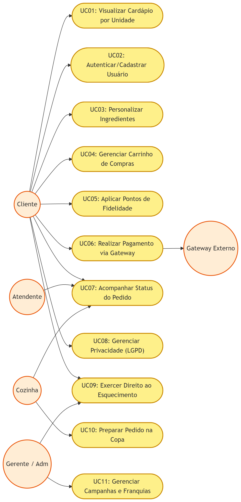
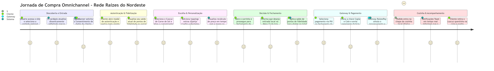
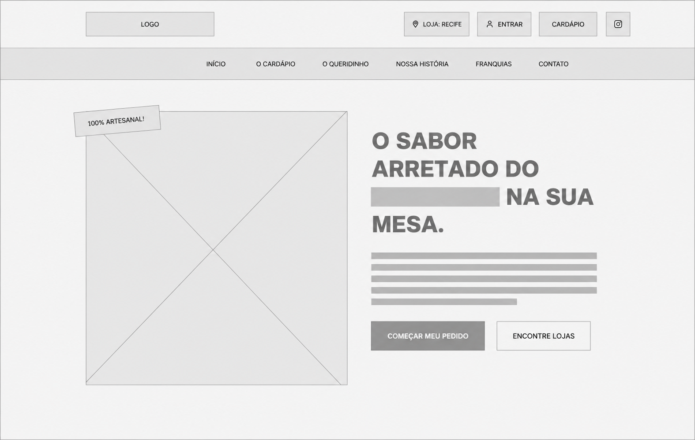
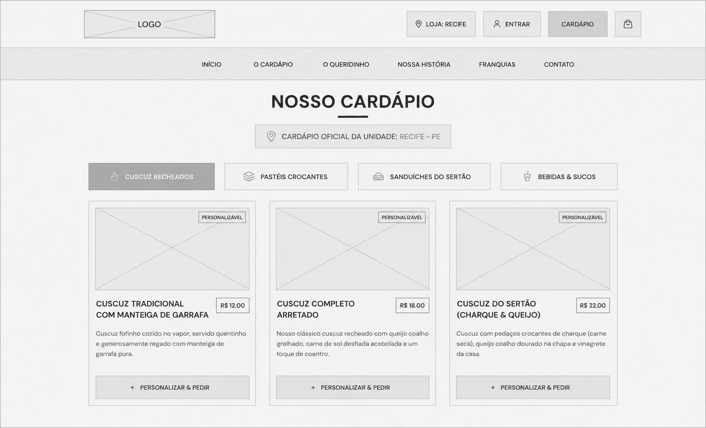
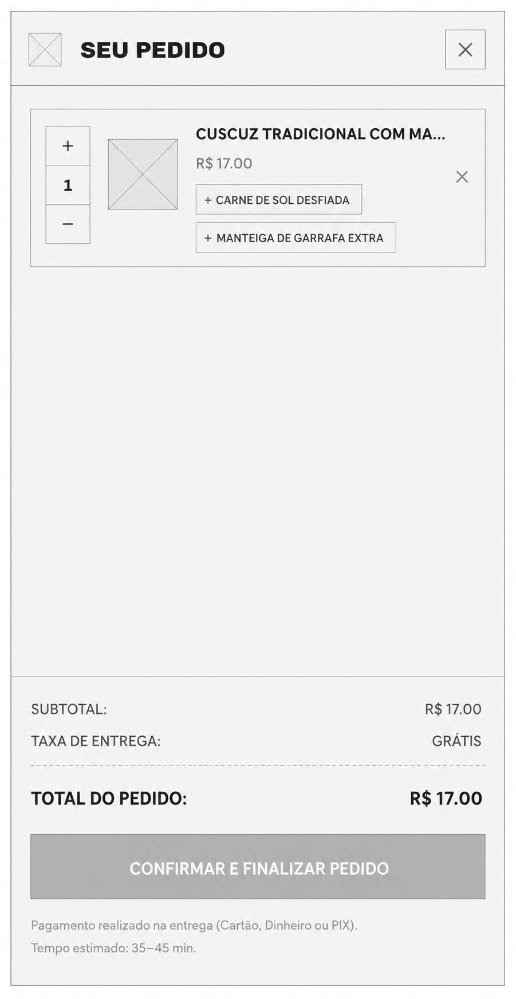

<style>
  /* Configuração Geral da Página */
  @page {
    size: A4;
    margin: 3cm 2cm 2cm 3cm; /* ABNT: superior 3, inferior 2, direita 2, esquerda 3 */
  }
  
  @media print {
    body {
      font-family: Arial, Helvetica, sans-serif;
      font-size: 12pt;
      line-height: 1.5;
      color: #000;
      background: #fff;
    }
    
    /* Impedir cabeçalhos de ficarem sozinhos no fim da página */
    h1, h2, h3, h4, h5, h6 {
      page-break-after: avoid;
      break-after: avoid;
      color: #000;
    }
    
    /* Forçar quebras de página */
    .page-break {
      page-break-before: always;
      break-before: page;
      height: 0;
      margin: 0;
      border: none;
    }
    
    /* Estilização de Tabelas ABNT */
    table {
      width: 100%;
      border-collapse: collapse;
      margin: 1.5cm 0;
      font-size: 10pt;
    }
    
    th, td {
      border: 1px solid #000;
      padding: 6px 10px;
    }
    
    th {
      background-color: #f2f2f2;
      font-weight: bold;
    }
    
    /* Bloqueia quebras de linha dentro da tabela quando indesejado */
    tr {
      page-break-inside: avoid;
      break-inside: avoid;
    }

    /* Estilo dos Wireframes ASCII */
    pre.ascii-wireframe {
      font-family: 'Courier New', Courier, monospace;
      font-size: 6.5pt !important;
      line-height: 1.05 !important;
      letter-spacing: -0.3px !important;
      white-space: pre !important;
      word-wrap: normal !important;
      overflow: visible !important;
      border: 1px solid #ccc;
      padding: 5px;
      margin: 1cm 0;
      page-break-inside: avoid;
      break-inside: avoid;
    }

    /* Ocultar banners ou modais interativos no PDF se houver */
    .no-print {
      display: none;
    }

    /* Estilo para imagens ABNT */
    img {
      max-width: 100%;
      height: auto;
      max-height: 18cm;
      display: block;
      margin: 1cm auto;
      page-break-inside: avoid;
      break-inside: avoid;
      border: 1px solid #ccc;
      padding: 5px;
    }
    
    .figure-caption {
      font-size: 10pt;
      text-align: center;
      margin-top: 5px;
      font-family: Arial, Helvetica, sans-serif;
      page-break-before: avoid;
      break-before: avoid;
    }
  }

  /* Estilos adicionais para visualização no navegador/editor */
  body {
    max-width: 800px;
    margin: 0 auto;
    padding: 20px;
    font-family: Arial, Helvetica, sans-serif;
    line-height: 1.6;
  }
  
  .page-break {
    border-top: 1px dashed #ccc;
    margin: 40px 0;
    position: relative;
  }
  
  .page-break::after {
    content: "QUEBRA DE PÁGINA (PDF)";
    position: absolute;
    top: -10px;
    right: 10px;
    font-size: 9px;
    background: #eee;
    padding: 2px 5px;
    color: #666;
  }

  /* Capa Acadêmica */
  .capa-container {
    width: 100%;
    margin: 0 auto;
    font-family: Arial, sans-serif;
    text-align: center;
    box-sizing: border-box;
  }

  .capa-header {
    margin-top: 1cm;
    margin-bottom: 4cm;
  }

  .capa-institution {
    font-size: 14pt;
    font-weight: bold;
    letter-spacing: 1px;
    margin: 0;
    text-transform: uppercase;
    line-height: 1.4;
  }

  .capa-course {
    font-size: 12pt;
    font-weight: bold;
    margin: 8px 0 0 0;
    text-transform: uppercase;
  }

  .capa-middle {
    margin-bottom: 4cm;
  }

  .capa-title-disc {
    font-size: 12pt;
    font-weight: normal;
    letter-spacing: 1px;
    text-transform: uppercase;
    margin: 0;
  }

  .capa-title-project {
    font-size: 18pt;
    font-weight: bold;
    margin: 15px 0 0 0;
    letter-spacing: 1.5px;
    text-transform: uppercase;
  }

  .capa-metadata {
    font-size: 11pt;
    text-align: left;
    display: inline-block;
    margin: 0 auto 4cm auto;
    line-height: 1.8;
  }

  .capa-footer {
    margin-top: auto;
  }

  .capa-location {
    font-size: 11pt;
    font-weight: bold;
    margin: 0;
    text-transform: uppercase;
  }

  .capa-year {
    font-size: 11pt;
    margin: 5px 0 0 0;
  }

  /* Sumário Acadêmico */
  .sumario-container {
    margin: 2cm 0;
  }
  
  .sumario-title {
    font-size: 16pt;
    font-weight: bold;
    text-align: center;
    margin-bottom: 1.5cm;
    text-transform: uppercase;
  }

  .sumario-list {
    list-style: none;
    padding: 0;
    margin: 0;
  }

  .sumario-item {
    display: flex;
    align-items: flex-end;
    margin-bottom: 12px;
    font-size: 11pt;
  }

  .sumario-item.indent-1 {
    margin-left: 20px;
  }

  .sumario-item.indent-2 {
    margin-left: 40px;
  }

  .sumario-name {
    font-weight: bold;
  }
  
  .sumario-item.indent-1 .sumario-name,
  .sumario-item.indent-2 .sumario-name {
    font-weight: normal;
  }

  .sumario-dots {
    flex-grow: 1;
    border-bottom: 1px dotted #000;
    margin: 0 10px;
    position: relative;
    bottom: 4px;
  }

  .sumario-page {
    font-weight: bold;
  }
  
  .sumario-item.indent-1 .sumario-page,
  .sumario-item.indent-2 .sumario-page {
    font-weight: normal;
  }
</style>

<div class="capa-container">
  <div class="capa-header">
    <div class="capa-institution">Centro Universitário Internacional UNINTER</div>
    <div class="capa-course">Curso Superior de Análise e Desenvolvimento de Sistemas</div>
  </div>
  
  <div class="capa-middle">
    <div class="capa-title-disc">Projeto Multidisciplinar – Trilha Front-End</div>
    <div class="capa-title-project">Raízes do Nordeste</div>
  </div>
  
  <div class="capa-metadata">
    <div><strong>Aluno:</strong> Luan Oliveira</div>
    <div><strong>RU:</strong> 4699873</div>
    <div><strong>Prof. Esp.:</strong> Giuliano Lanes de Almeida</div>
    <div><strong>PAP:</strong> São José do Egito - PE</div>
  </div>
  
  <div class="capa-footer">
    <div class="capa-location">São José do Egito - PE</div>
    <div class="capa-year">2026</div>
  </div>
</div>

<div class="page-break"></div>

<div class="sumario-container">
  <div class="sumario-title">Sumário</div>
  <ul class="sumario-list">
    <li class="sumario-item">
      <span class="sumario-name">1. INTRODUÇÃO E OBJETIVOS</span>
      <span class="sumario-dots"></span>
      <span class="sumario-page">3</span>
    </li>
    <li class="sumario-item">
      <span class="sumario-name">2. ANÁLISE E REQUISITOS DO SISTEMA</span>
      <span class="sumario-dots"></span>
      <span class="sumario-page">4</span>
    </li>
    <li class="sumario-item indent-1">
      <span class="sumario-name">2.1. Requisitos Funcionais (RF)</span>
      <span class="sumario-dots"></span>
      <span class="sumario-page">4</span>
    </li>
    <li class="sumario-item indent-1">
      <span class="sumario-name">2.2. Requisitos Não Funcionais (RNF)</span>
      <span class="sumario-dots"></span>
      <span class="sumario-page">5</span>
    </li>
    <li class="sumario-item">
      <span class="sumario-name">3. MODELAGEM E ARQUITETURA DA INTERFACE</span>
      <span class="sumario-dots"></span>
      <span class="sumario-page">6</span>
    </li>
    <li class="sumario-item indent-1">
      <span class="sumario-name">3.1. Diagrama de Casos de Uso</span>
      <span class="sumario-dots"></span>
      <span class="sumario-page">6</span>
    </li>
    <li class="sumario-item indent-1">
      <span class="sumario-name">3.2. Descrição Detalhada de Feature (Realizar Pagamento)</span>
      <span class="sumario-dots"></span>
      <span class="sumario-page">7</span>
    </li>
    <li class="sumario-item indent-1">
      <span class="sumario-name">3.3. Diagrama da Jornada do Usuário</span>
      <span class="sumario-dots"></span>
      <span class="sumario-page">9</span>
    </li>
    <li class="sumario-item">
      <span class="sumario-name">4. WIREFRAMES</span>
      <span class="sumario-dots"></span>
      <span class="sumario-page">10</span>
    </li>
    <li class="sumario-item indent-1">
      <span class="sumario-name">4.1. Tela Inicial (Hero)</span>
      <span class="sumario-dots"></span>
      <span class="sumario-page">10</span>
    </li>
    <li class="sumario-item indent-1">
      <span class="sumario-name">4.2. Tela de Cardápio</span>
      <span class="sumario-dots"></span>
      <span class="sumario-page">11</span>
    </li>
    <li class="sumario-item indent-1">
      <span class="sumario-name">4.3. Tela de Carrinho / Pedido</span>
      <span class="sumario-dots"></span>
      <span class="sumario-page">12</span>
    </li>
    <li class="sumario-item indent-1">
      <span class="sumario-name">4.4. Tela de Login / Cadastro</span>
      <span class="sumario-dots"></span>
      <span class="sumario-page">13</span>
    </li>
    <li class="sumario-item">
      <span class="sumario-name">5. LGPD E PRIVACIDADE DA INTERFACE</span>
      <span class="sumario-dots"></span>
      <span class="sumario-page">14</span>
    </li>
    <li class="sumario-item indent-1">
      <span class="sumario-name">5.1. Transparência e Consentimento Granular</span>
      <span class="sumario-dots"></span>
      <span class="sumario-page">14</span>
    </li>
    <li class="sumario-item indent-1">
      <span class="sumario-name">5.2. Direitos do Titular no Frontend (Artigo 18 LGPD)</span>
      <span class="sumario-dots"></span>
      <span class="sumario-page">15</span>
    </li>
    <li class="sumario-item indent-1">
      <span class="sumario-name">5.3. Salvaguardas Técnicas e Direito ao Esquecimento</span>
      <span class="sumario-dots"></span>
      <span class="sumario-page">15</span>
    </li>
    <li class="sumario-item">
      <span class="sumario-name">6. ENTREGA TÉCNICA E ARQUITETURA DE SOFTWARE</span>
      <span class="sumario-dots"></span>
      <span class="sumario-page">16</span>
    </li>
    <li class="sumario-item indent-1">
      <span class="sumario-name">6.1. Tecnologias Adotadas</span>
      <span class="sumario-dots"></span>
      <span class="sumario-page">16</span>
    </li>
    <li class="sumario-item indent-1">
      <span class="sumario-name">6.2. Estrutura do Repositório</span>
      <span class="sumario-dots"></span>
      <span class="sumario-page">17</span>
    </li>
    <li class="sumario-item indent-1">
      <span class="sumario-name">6.3. Links de Publicação e Código</span>
      <span class="sumario-dots"></span>
      <span class="sumario-page">17</span>
    </li>
    <li class="sumario-item">
      <span class="sumario-name">7. PLANO E CENÁRIOS DE TESTE DA INTERFACE</span>
      <span class="sumario-dots"></span>
      <span class="sumario-page">18</span>
    </li>
    <li class="sumario-item indent-1">
      <span class="sumario-name">7.1. Estratégia de Validação</span>
      <span class="sumario-dots"></span>
      <span class="sumario-page">18</span>
    </li>
    <li class="sumario-item indent-1">
      <span class="sumario-name">7.2. Tabela de Cenários de Teste (Mínimo de 10 Cenários)</span>
      <span class="sumario-dots"></span>
      <span class="sumario-page">18</span>
    </li>
    <li class="sumario-item">
      <span class="sumario-name">8. CONCLUSÃO</span>
      <span class="sumario-dots"></span>
      <span class="sumario-page">19</span>
    </li>
    <li class="sumario-item">
      <span class="sumario-name">9. DECLARAÇÃO DE USO DE INTELIGÊNCIA ARTIFICIAL</span>
      <span class="sumario-dots"></span>
      <span class="sumario-page">19</span>
    </li>
    <li class="sumario-item">
      <span class="sumario-name">10. REFERÊNCIAS BIBLIOGRÁFICAS (ABNT)</span>
      <span class="sumario-dots"></span>
      <span class="sumario-page">20</span>
    </li>
  </ul>
</div>

<div class="page-break"></div>

## 1. INTRODUÇÃO E OBJETIVOS

A expansão ordenada e escalável de redes de lanchonetes regionalizadas exige soluções digitais que não apenas repliquem as transações de compra fisicamente consolidadas, mas que também capturem a identidade cultural da marca e forneçam uma experiência consistente através de múltiplos canais de interação (omnichannel). Este projeto multidisciplinar documenta e desenvolve a interface e fluxo de atendimento para a **Rede Raízes do Nordeste**, uma franquia especializada na culinária nordestina, em especial o cuscuz temperado e recheado.

O objetivo deste projeto consiste em conceber, justificar e codificar um ecossistema front-end unificado voltado a suportar três canais de atendimento essenciais no varejo moderno:

- **Web (Desktop/Mobile):** Focado no e-commerce tradicional de delivery e agendamento remoto de refeições.
- **Totem (Kiosk):** Desenvolvido com ergonomia própria para terminais físicos de autoatendimento localizados no interior das lojas físicas.
- **App (Mobile Nativo/Smartphone Mockup):** Projetado sob a ótica da conveniência e agilidade móvel, integrado a um programa robusto de fidelidade e cashback.

O diferencial do projeto assenta-se na maturidade técnica de sua arquitetura: a aplicação foi codificada em **React (Vite) com JavaScript ES6+ e CSS customizado**, operando com dados mockados dinâmicos e controle de estado global reativo. A solução integra de forma explícita regras de fidelização de clientes, simulação realística de gateway financeiro de pagamento externo e uma central granular de privacidade em estrita conformidade com a Lei Geral de Proteção de Dados (LGPD - Lei nº 13.709/2018).

<div class="page-break"></div>

## 2. ANÁLISE E REQUISITOS DO SISTEMA

### 2.1. Requisitos Funcionais (RF)

Os requisitos funcionais detalham os serviços e fluxos operacionais que a interface torna acessíveis ao usuário final.

| Código    | Descrição Curta                | Detalhamento Técnico da Experiência do Usuário                                                                                                                                             |
| :-------- | :----------------------------- | :----------------------------------------------------------------------------------------------------------------------------------------------------------------------------------------- |
| **RF-01** | Cadastro e Autenticação        | Formulário reativo para login/cadastro (`AuthModal`). Salva os dados localmente para manter a sessão ativa, atribuindo pontuação de fidelidade mockada imediata.                           |
| **RF-02** | Seleção Dinâmica de Unidade    | Localização de quiosques e alteração automática de cardápio baseado na unidade ativa (`FranchiseSection` e `MenuSection`), adequando preços e disponibilidade regional.                    |
| **RF-03** | Customização de Ingredientes   | Customização de cuscuz estilo "Five Guys" (`IngredientsCustomizer`), permitindo ao usuário selecionar adicionais com recálculo instantâneo do valor do item no carrinho.                   |
| **RF-04** | Fluxo de Pedido Completo       | Adição de itens ao carrinho (`CartDrawer`), ajuste de quantidades, fechamento de pedido (`CheckoutModal`) e escolha entre Delivery em domicílio ou Retirada na mesa da loja física.        |
| **RF-05** | Programa de Fidelização        | Integração de pontos de fidelidade acumulados. Permite a dedução de pontos no checkout como desconto real (`1 ponto = R$ 1,00`), além de painel de controle de cashback (`FidelityModal`). |
| **RF-06** | Campanha Promocional           | Seção dedicada ao destaque de combos promocionais regionais e kits familiares (`PromoSection`), integrando-os com adição rápida ao carrinho.                                               |
| **RF-07** | Integração com Gateway Externo | Representação visual do fluxo de envio do pagamento e retorno do status em sandbox financeiro simulado ("RaízesPay") via PIX (QR Code e Copia/Cole) ou Cartão de Crédito.                  |
| **RF-08** | Rastreamento do Pedido         | Acompanhamento do status de preparação na cozinha em tempo real (`OrderTracker`), com avanço reativo em 4 estágios (`recebido` ➔ `preparando` ➔ `pronto` ➔ `entregue`).                    |
| **RF-09** | Banner de Consentimento LGPD   | Banner inicial obstrutivo parcial (`LgpdBanner`) contendo opções explícitas de Aceitar, Recusar ou Customizar os tipos de cookies de navegação e tratamento de dados.                      |
| **RF-10** | Central de Privacidade LGPD    | Modal para gerenciamento de direitos (`PrivacyCenterModal`), possibilitando consentimento granular de cookies, exportação de dados (JSON) e Exercício do Direito ao Esquecimento.          |

### 2.2. Requisitos Não Funcionais (RNF)

Os requisitos não funcionais especificam critérios técnicos que qualificam o comportamento e a restrição de design da solução desenvolvida.

- **RNF-01: Abordagem Mobile-First e Responsividade:** A interface foi concebida utilizando prioritariamente estruturas flexíveis voltadas para telas móveis (360px a 480px) e, subsequentemente, expandida via media-queries CSS para resoluções de desktop (1024px a 1440px). A responsividade e adaptabilidade multicanal (App/Totem/Web) podem ser validadas dinamicamente através do redimensionamento do navegador ou via ferramentas de desenvolvedor (F12 - Device Mode).
- **RNF-02: Alta Performance de Carregamento:** Redução de dependências externas complexas. Uso de pacotes leves (`lucide-react` para vetores SVG, `framer-motion` para animações fluidas baseadas em GPU física). Imagens otimizadas em formato de última geração (`.webp`).
- **RNF-03: Robustez de Estado Global:** Gerenciamento centralizado de fluxo de dados por meio do padrão Context API do React (`AppContext.jsx`), prevenindo "prop drilling" e assegurando que modificações em fidelidade ou carrinho reflitam-se instantaneamente em todas as telas e canais simulados.
- **RNF-04: Acessibilidade Semântica e SEO:** Utilização estrita de tags HTML5 estruturantes (`<header>`, `<nav>`, `<main>`, `<section>`, `<footer>`), propriedades de acessibilidade e uma hierarquia consistente de cabeçalhos (`<h1>` único por canal, seguido por `<h2>` e `<h3>`).

<div class="page-break"></div>

## 3. MODELAGEM E ARQUITETURA DA INTERFACE

### 3.1. Diagrama de Casos de Uso

A lógica operacional e a interação dos atores da Rede Raízes do Nordeste são modeladas e visualizadas a seguir:



### 3.2. Descrição Detalhada de Feature (Realizar Pagamento)

Abaixo, detalha-se o caso de uso crítico **UC06: Realizar Pagamento via Gateway** para demonstrar como o sistema reativo lida com processamento seguro externo de forma conceitual na interface.

- **Atores Principais:** Cliente, Gateway de Pagamento Externo (RaízesPay).
- **Pré-condições:** O Cliente deve possuir ao menos um item válido no carrinho de compras e ter preenchido com sucesso os dados de envio (Delivery ou Mesa/Quiosque) na Etapa 1 do checkout.
- **Fluxo Principal:**
  1.  O usuário, na Etapa 3 do `CheckoutModal`, escolhe o método de pagamento externo: **PIX Instantâneo** ou **Cartão de Crédito**.
  2.  Caso escolha **PIX**: O sistema renderiza um QR Code dinâmico fictício e disponibiliza um botão para copiar a chave Pix Copia e Cole para a área de transferência.
  3.  Caso escolha **Cartão de Crédito**: O usuário preenche os campos do formulário (Nome, Número, Validade, CVV). O sistema realiza a validação de formato e comprimento em tempo real.
  4.  O usuário clica no botão "Enviar e Pagar via Gateway".
  5.  A interface intercepta a ação e exibe uma tela sobreposta (Overlay) com indicador de carregamento animado identificando a transação externa ativa: `🔒 GATEWAY SEGURO EXTERNO: RAIZESPAY`.
  6.  Durante 2.5 segundos, a interface bloqueia novas interações físicas do usuário para simular de forma fiel a autorização bancária e a comunicação do protocolo.
  7.  Após o retorno positivo do simulador, o painel muda visualmente para um estado de Sucesso (`PAGAMENTO AUTORIZADO!`), gerando um feedback auditivo/visual claro.
  8.  O carrinho é limpo automaticamente, os pontos de fidelidade gerados na compra (10% de cashback) são computados na conta do usuário no local storage, o checkout é encerrado e o painel de Acompanhamento do Pedido (`OrderTracker`) é iniciado.
- **Fluxo Alternativo (Tratamento de Erros / Exceção):**
  - _Se dados do cartão inválidos:_ O formulário exibe mensagens de erro em vermelho abaixo de cada campo específico, impedindo o envio para o gateway até a correção do preenchimento pelo usuário.
  - _Se cookies funcionais recusados no banner da LGPD:_ O usuário é notificado de que dados pessoais e de fidelidade não poderão ser salvos persistentemente no navegador. A compra avança em modo estritamente anônimo e temporário.

### 3.3. Diagrama da Jornada do Usuário

Mapeia o percurso emocional, as decisões, os estados do sistema e as interações do cliente desde o primeiro acesso até o recebimento e consumo do pedido.



<div class="page-break"></div>

## 4. WIREFRAMES

Para demonstrar a arquitetura da informação e a adaptabilidade espacial em canais físicos e virtuais, os wireframes de baixa fidelidade desenvolvidos para a Rede Raízes do Nordeste são apresentados a seguir.

<div class="page-break"></div>

### 4.1. Tela Inicial (Hero)

Foco em visualização ampla de marca, transições elegantes de conteúdo e conveniência do comércio eletrônico de entrega em domicílio.

<div style="text-align: center; margin: 1.5cm 0;">
  
  <div class="figure-caption"><strong>Figura 3</strong> – Wireframe da tela inicial (Web/Desktop). Fonte: próprio autor, 2026.</div>
</div>

<div class="page-break"></div>

### 4.2. Tela de Cardápio

Ergonomia focada em telas verticais de grandes proporções. Navegação otimizada para toque (Touch), remoção de seções institucionais de longo texto (Sobre Nós/Contato), foco imediato no fechamento de compra local rápida e cabeçalho fixo informando o modo Kiosk.

<div style="text-align: center; margin: 1.5cm 0;">
  
  <div class="figure-caption"><strong>Figura 4</strong> – Wireframe da tela de cardápio com seletor de unidade. Fonte: próprio autor, 2026.</div>
</div>

<div class="page-break"></div>

### 4.3. Tela de Carrinho / Pedido

Projetado sob a ótica da portabilidade. Menu sanduíche, grids flexíveis de uma ou duas colunas de produtos, botão de carrinho flutuante na parte inferior e mockup físico renderizado em tela em alta definição.

<div style="text-align: center; margin: 1.5cm 0;">
  
  <div class="figure-caption"><strong>Figura 5</strong> – Wireframe da tela de carrinho e finalização do pedido. Fonte: próprio autor, 2026.</div>
</div>

<div class="page-break"></div>

### 4.4. Tela de Login / Cadastro

Interface de login/cadastro reativa com integração de consentimento aos cookies e regras da LGPD diretamente no formulário de autenticação.

<div style="text-align: center; margin: 1.5cm 0;">
  
  <div class="figure-caption"><strong>Figura 6</strong> – Wireframes das telas de autenticação e cadastro com consentimento LGPD. Fonte: próprio autor, 2026.</div>
</div>

<div class="page-break"></div>

## 5. LGPD E PRIVACIDADE DA INTERFACE

A privacidade de dados pessoais e o respeito às escolhas de navegação do cliente constituem o cerne ético e regulatório da interface da Rede Raízes do Nordeste. Diferente de aplicações genéricas, o sistema implementa de forma tangível em código e componentes os princípios estipulados pela Lei Geral de Proteção de Dados (LGPD).

### 5.1. Transparência e Consentimento Granular

Logo no primeiro acesso à aplicação, um banner persistente (`LgpdBanner.jsx`) alerta de forma didática sobre o uso de dados. Em vez de forçar um aceite cego, a interface oferece três botões com pesos visuais equilibrados: "Aceitar Todos", "Recusar" e "Preferências".
Ao selecionar "Preferências", o cliente é direcionado à **Central de Privacidade** (`PrivacyCenterModal.jsx`), que categoriza e permite a desativação granular das finalidades de cookies:

1.  **Cookies Estritamente Necessários (Essenciais):** Obrigatórios para o processamento de compras (carrinho) e controle seguro de sessão. Não podem ser desativados por critérios funcionais básicos.
2.  **Cookies Estatísticos e Desempenho:** Coleta anônima de tráfego físico. Podem ser desativados livremente.
3.  **Cookies de Marketing e Promoções:** Memorização de franquias e ativação de cupons regionais. Podem ser ativados/desativados sob critério do usuário.

### 5.2. Direitos do Titular no Frontend (Artigo 18 LGPD)

A Central de Privacidade implementa botões interativos para simular e concretizar direitos garantidos pelo Artigo 18 da LGPD:

- **Direito de Acesso e Portabilidade:** O usuário cadastrado pode clicar em "Exportar meus dados (JSON)". O sistema gera e descarrega dinamicamente no computador do usuário um relatório oficial (`raizes_nordeste_lgpd_relatorio.json`) mapeando de forma estruturada todos os dados pessoais mantidos na sessão e no local storage (Nome, Email, histórico de pontos e cookies ativos).
- **Direito ao Esquecimento (Eliminação de Dados):** O usuário possui acesso ao botão "Excluir meus dados". Ao ser acionado, o sistema solicita confirmação do usuário e prossegue com a eliminação total e irreversível de todas as informações pessoais do armazenamento do navegador (contas mockadas, saldo de pontos e histórico de pedidos), deslogando a sessão imediatamente.

### 5.3. Salvaguardas Técnicas e Direito ao Esquecimento

Técnicas modernas de armazenamento seguro foram aplicadas no front-end:

```javascript
const saveCookieConsent = (type) => {
  setCookieConsent(type);
  localStorage.setItem('raizes_cookie_consent', type);
  if (type === 'rejected') {
    // Purga imediata de dados do usuário em caso de revogação de consentimento
    setUser(null);
    localStorage.removeItem('raizes_user');
    localStorage.removeItem('raizes_order');
    setActiveOrder(null);
  }
};
```

O código acima ilustra a conformidade técnica: se o consentimento é rejeitado ou retirado pelo cliente, toda a persistência de dados pessoais identificáveis no `localStorage` é imediatamente purgada de forma ativa e transparente, garantindo o "privacy by design".

<div class="page-break"></div>

## 6. ENTREGA TÉCNICA E ARQUITETURA DE SOFTWARE

### 6.1. Tecnologias Adotadas

A codificação da Rede Raízes do Nordeste foi baseada em tecnologia de alto padrão profissional de desenvolvimento front-end:

- **React 18.x:** Biblioteca base para a construção das interfaces reativas baseadas em componentes declarativos.
- **JavaScript ES6+:** Sintaxe moderna para tratamento de listas de produtos, ordenação de quiosques e estruturação lógica de estados.
- **CSS Customizado (Vanilla CSS):** Estilização baseada em tokens profissionais de Design System Brutalista em `src/index.css`. Cores vibrantes corporativas, bordas espessas de alto contraste, sombreamento duro e fontes de alta legibilidade (Inter e Oswald).
- **Framer Motion:** Biblioteca especializada em animações reativas para transição de modais, drawers de carrinho e alertas, garantindo leveza e fluidez de movimento.
- **Lucide-React:** Kit de vetores escaláveis SVG para representação de ícones de interface limpos e livre de distorções.

### 6.2. Estrutura do Repositório

A arquitetura do projeto segue o modelo modular Domain-Driven Design (DDD) simplificado para o frontend, mantendo uma clara separação de interesses:

```text
Raízes do Nordeste/
├── public/                 # Ativos públicos, imagens de pratos regionais e SVGs
├── src/
│   ├── components/         # Componentes organizados por áreas de domínio
│   │   ├── bulk/           # Modais e fluxos de compra coletiva
│   │   ├── cart/           # Carrinho, gaveta lateral e checkout (Gateway)
│   │   ├── common/         # Componentes reutilizáveis (Toasts, alertas)
│   │   ├── forms/          # Autenticação de conta e fidelidade do cliente
│   │   ├── layout/         # Cabeçalho e menu de navegação do site
│   │   ├── lgpd/           # Banner e Central de Privacidade dos dados
│   │   ├── menu/           # Grid de produtos, cartões e customizador de cuscuz
│   │   ├── order/          # Acompanhador dinâmico de status na cozinha
│   │   └── sections/       # Seções estendidas (Hero, Combos, Quiosques, Contato)
│   ├── constants/          # Constantes estáticas e mock data (Quiosques, Itens)
│   │   └── index.js
│   ├── context/            # Provedor de contexto para gerenciamento de estado global
│   │   └── AppContext.jsx
│   ├── App.jsx             # Componente estrutural e agregador de seções e modais
│   ├── index.css           # Tokenização do design system brutalista unificado
│   └── main.jsx            # Ponto de entrada de renderização do React DOM
├── index.html              # Estrutura base de carregamento e tags SEO meta
├── package.json            # Metadados e dependências técnicas do ecossistema
└── vite.config.js          # Configurações de compilação rápida do bundler Vite
```

### 6.3. Links de Publicação e Código

Como exigido pelo Roteiro da Atividade Prática para a demonstração técnica (Opção B - Codificação), são fornecidos os links públicos funcionais:

- **Link do Repositório Git (GitHub):** [https://github.com/Luanvictordev/RaizesDoNordeste](https://github.com/Luanvictordev/RaizesDoNordeste)
- **URL de Publicação (GitHub Pages):** [https://luanvictordev.github.io/RaizesDoNordeste/](https://luanvictordev.github.io/RaizesDoNordeste/)

<div class="page-break"></div>

## 7. PLANO E CENÁRIOS DE TESTE DA INTERFACE

### 7.1. Estratégia de Validação

Para assegurar a confiabilidade, usabilidade, responsividade física e a conformidade integral da interface com as regras de negócio e proteção de dados, adotou-se um plano sistemático de testes de front-end. O plano de testes contempla cenários positivos (comportamento ideal esperado) e cenários negativos (tratamento de dados incorretos e segurança do fluxo), com foco em verificar:

1.  A integridade de layout e transição entre os canais Web, Totem e App.
2.  A exatidão aritmética na aplicação de pontos de fidelidade no checkout.
3.  A consistência de comportamento ao recursar cookies/purgar dados (LGPD).
4.  As validações em tempo real do formulário do gateway externo de pagamento.

### 7.2. Tabela de Cenários de Teste (Mínimo de 10 Cenários)

| ID        | Nome do Cenário                                             | Canal de Teste    | Tipo     | Entradas (Inputs)                                                                        | Fluxo de Execução                                                                                       | Saída Esperada                                                                                      | Validação e Mensagens de Erro                                                                                   |
| :-------- | :---------------------------------------------------------- | :---------------- | :------- | :--------------------------------------------------------------------------------------- | :------------------------------------------------------------------------------------------------------ | :-------------------------------------------------------------------------------------------------- | :-------------------------------------------------------------------------------------------------------------- |
| **CT-01** | Login com credenciais válidas                               | Web / App / Totem | Positivo | Nome: "Maria Silva"<br>Email: "maria@teste.com"                                          | Abrir modal de autenticação, preencher dados válidos e clicar em "Acessar Conta".                       | O modal fecha, um Toast de boas-vindas é exibido e o saldo de pontos (150 pts) é ativado.           | Login efetuado com sucesso.<br>_Mensagem: "Bem-vindo, Maria Silva!"_                                            |
| **CT-02** | Login sem preenchimento de campos                           | Web               | Negativo | Nome: "" (vazio)<br>Email: "" (vazio)                                                    | Abrir modal de autenticação, deixar campos em branco e clicar em "Acessar Conta".                       | O sistema bloqueia a submissão física e sinaliza erro de formulário.                                | Campos obrigatórios de login são validados no HTML.<br>_Validação nativa de obrigatoriedade._                   |
| **CT-03** | Alteração dinâmica de cardápio por quiosque                 | Web / App / Totem | Positivo | Clique na unidade "Salvador" na listagem de quiosques.                                   | Rolar até a seção de quiosques, selecionar a unidade soteropolitana.                                    | A seção de cardápio atualiza seu banner, indicando que os produtos exibidos pertencem à Salvador.   | O estado `selectedFranchise` é atualizado.<br>_Texto: "CARDÁPIO OFICIAL DA UNIDADE: Salvador"_                  |
| **CT-04** | Customização de cuscuz com ingredientes adicionais          | Web / App         | Positivo | Seleção do prato "Cuscuz Tradicional" e adição de "Queijo Coalho" (+R$ 4,00).            | Clicar em "Personalizar" no item, marcar o adicional desejado no modal e clicar em "Confirmar".         | O cuscuz é inserido no carrinho com o valor total recalculado para R$ 16,90 (R$ 12,90 + R$ 4,00).   | O carrinho exibe o item com o array de adicionais listados.<br>_Mensagem: "Adicionado com adicionais!"_         |
| **CT-05** | Aplicação de desconto de pontos de fidelidade no checkout   | Web / App         | Positivo | Marcar caixa de seleção: "Usar 26 pontos para R$ 26,00 de desconto!"                     | Adicionar itens ao carrinho, clicar em checkout, avançar para etapa 2, habilitar o desconto de pontos.  | O total do pedido é deduzido instantaneamente. R$ 26,00 são abatidos da soma total a pagar.         | Recálculo de valores visíveis em tempo real.<br>_Dedução: "- R$ 26,00" na linha de desconto._                   |
| **CT-06** | Fechamento de pedido via delivery sem dados de endereço     | Web / App         | Negativo | Endereço: "" (vazio)<br>Telefone: "(81) 99999-9999"                                      | Habilitar modal de checkout, selecionar a opção "Delivery", deixar endereço em branco e tentar avançar. | O sistema impede a transição para a Etapa 2 e renderiza um alerta em vermelho abaixo do campo.      | Validação reativa de strings no formulário.<br>_Mensagem de erro: "O endereço de entrega é obrigatório"_        |
| **CT-07** | Pagamento via PIX seguro com simulação de Gateway externo   | Web / App / Totem | Positivo | Seleção do método de pagamento: "PIX Instantâneo"                                        | Avançar para a Etapa 3 do checkout, clicar em "PIX Instantâneo" e acionar "Enviar e Pagar via Gateway". | Exibe o QR Code, abre o loader "PROCESSANDO TRANSAÇÃO FINANCEIRA" por 2.5s e confirma com sucesso.  | Representação de sandbox financeiro bem-sucedida.<br>_Mensagem: "PAGAMENTO AUTORIZADO!"_                        |
| **CT-08** | Pagamento via cartão de crédito com numeração incompleta    | Web / App         | Negativo | Cartão: "1234 56" (incompleto)<br>Nome: "MARIA SILVA"<br>Validade: "12/28"<br>CVV: "123" | Selecionar método "Cartão de Crédito" no checkout, preencher numeração errada e clicar em Enviar.       | O sistema aborta o envio ao gateway e destaca a borda do campo do cartão de crédito em vermelho.    | Validação de comprimento de string ativa no front.<br>_Mensagem de erro: "Cartão inválido (mínimo 16 dígitos)"_ |
| **CT-09** | Acompanhamento do status de preparação do cuscuz na cozinha | Web / App / Totem | Positivo | Envio final de pedido pago com sucesso.                                                  | Finalizar o checkout. O rastreador de pedido é renderizado flutuante na lateral.                        | O indicador visual de status avança a cada 10s (`recebido` ➔ `preparando` ➔ `pronto` ➔ `entregue`). | Notificações Toasts avisam sobre o andamento.<br>_Mensagem: "Seu cuscuz entrou na chapa!"_                      |
| **CT-10** | Exportação de dados pessoais em arquivo JSON (LGPD Art. 18) | Web / App         | Positivo | Login ativo com o usuário mockado e cliques em "Exportar dados".                         | Acessar Central de Privacidade LGPD e clicar no botão "Exportar meus dados (JSON)".                     | Um arquivo JSON é descarregado automaticamente no navegador, mapeando cookies e dados cadastrados.  | Geração reativa de Blob e clique em link dinâmico.<br>_Mensagem: "Download do relatório iniciado!"_             |
| **CT-11** | Direito ao Esquecimento e eliminação de dados pessoais      | Web / App         | Positivo | Clique no botão "Excluir meus dados" com conta ativa.                                    | Acessar Central de Privacidade, clicar em "Excluir meus dados" e confirmar o alerta do navegador.       | Toda a persistência em memória local storage é eliminada, a sessão é encerrada e a página desloga.  | Execução de exclusão ativa e logout imediato.<br>_Mensagem: "Seus dados pessoais foram apagados!"_              |

<div class="page-break"></div>

## 8. CONCLUSÃO

O desenvolvimento do sistema reativo front-end para a **Rede Raízes do Nordeste** demonstra a viabilidade de aplicar padrões modernos de design de interfaces e engenharia de software para solucionar problemas reais de mercado.

Do ponto de vista de **integração técnica e fluxo**, a adoção de um estado global centralizado via Context API do React permitiu coordenar dinamicamente os múltiplos fluxos críticos: alteração de unidade geográfica com recálculo instantâneo de cardápio, acúmulo de pontos de fidelização em tempo real e simulação assíncrona do gateway financeiro. Essa integração espelha com fidelidade o comportamento de sistemas reais de e-commerce e autoatendimento em ambiente de produção.

A preocupação com a **Qualidade e testes da interface (QA)** foi atestada por meio do mapeamento de 11 cenários minuciosos de validação física do sistema. A interface demonstrou-se robusta contra falhas de entrada do usuário (campos vazios ou numeração inválida de cartão de crédito) e apresentou alta coerência na alternância de canais (Web, Totem e App), oferecendo layouts ergonômicos e específicos para cada terminal físico e digital de varejo.

Por fim, a **adequação estrita à LGPD** não se resumiu a uma mera declaração teórica em texto: o front-end materializa os direitos dos titulares através de elementos visuais claros de consentimento granular e da criação de funcionalidades reais de exportação e purga irreversível de dados pessoais identificáveis sob demanda. Isso garante que a Rede Raízes do Nordeste posicione-se no mercado não apenas com uma forte e vibrante identidade cultural e visual brutalista, mas como uma plataforma segura, madura e plenamente em conformidade legal.

<div class="page-break"></div>

## 9. DECLARAÇÃO DE USO DE INTELIGÊNCIA ARTIFICIAL

Em conformidade com os critérios éticos institucionais descritos no Roteiro de Atividade Prática, o autor declara o uso de ferramenta de Inteligência Artificial nas seguintes etapas e propósitos do projeto:

- **Ferramenta Utilizada:** Gemini 3.5 Flash (Antigravity AI Assistant, desenvolvido pelo time Google DeepMind).
- **Objetivos de Uso:**
  1.  _Geração de Imagens:_ Emprego de IA generativa para a concepção e renderização das imagens ilustrativas do cardápio (`cuscuz_hero.png`, `cuscuz_combo_supreme.png`, `cuscuzcomcarnedesolequeijocoalho.webp`, etc.) para simular fotos profissionais e realistas dos pratos nordestinos.
  2.  _Redação de Copy (Textos e Descrições):_ Auxílio na formulação textual de campanhas publicitárias da _Hero Section_ ("Cuscuz com identidade e arte brutalista") e das descrições dos itens culinários do cardápio e termos simplificados de conformidade da LGPD.
  3.  _Esboço de Wireframes de Baixa Fidelidade:_ Apoio na estruturação dos modelos de blocos textuais e posicionamento espacial dos elementos móveis e de desktop para compor os wireframes do projeto.
  4.  _Revisão Estrutural:_ Auxílio na organização formal do relatório técnico seguindo as diretrizes estruturais de normas acadêmicas da ABNT.
  5.  _Validação de Código e Lógica:_ Apoio na revisão de lógicas reativas e checagem de concorrência de estados reativos durante o desenvolvimento da simulação do gateway financeiro no modal de checkout.
  6.  _Modelagem de Fluxos:_ Apoio conceitual na elaboração do formato estruturado dos diagramas de Casos de Uso e Jornada do Usuário utilizando a notação Mermaid.
- **Prompts Empregados:**
  - _"Como posso estruturar um diagrama de casos de uso em Mermaid contendo múltiplos atores como cliente, atendente, cozinha, administrador e gateway de pagamento?"_
  - _"Quais as diretrizes para representar adequadamente a conformidade prática do artigo 18 da LGPD em interfaces front-end de e-commerce?"_
  - _"Gere uma imagem hiper-realista em formato .webp de um prato tradicional de cuscuz nordestino com carne de sol e queijo coalho grelhado por cima, fundo neutro."_
  - _"Escreva uma descrição atraente e com apelo regional (nordestino) para um cuscuz premium contendo carne de sol desfiada, queijo coalho e manteiga de garrafa."_
- **Trechos Aproveitados:** As estruturas base das tabelas de requisitos e cenários de teste, os wireframes estruturais base em formato de texto, os textos promocionais do cardápio e a conformidade conceitual com os termos legais da LGPD foram refinadas a partir das sugestões da ferramenta, com redação final autoral alinhada às especificidades do modelo de franquias da Rede Raízes do Nordeste.

<div class="page-break"></div>

## 10. REFERÊNCIAS BIBLIOGRÁFICAS (ABNT)

1.  **ASSOCIAÇÃO BRASILEIRA DE NORMAS TÉCNICAS (ABNT).** _NBR 14724: Informação e documentação - Trabalhos acadêmicos - Apresentação._ Rio de Janeiro: ABNT, 2011.
2.  **BRASIL.** _Lei nº 13.709, de 14 de agosto de 2018. Lei Geral de Proteção de Dados Pessoais (LGPD)._ Brasília, DF: Diário Oficial da União, 2018. Disponível em: <http://www.planalto.gov.br/ccivil_03/_ato2015-2018/2018/lei/l13709.htm>. Acesso em: 28 mai. 2026.
3.  **FLANAGAN, David.** _JavaScript: O Guia Definitivo._ 7. ed. Porto Alegre: Bookman, 2021.
4.  **KRUG, Steve.** _Não me Faça Pensar: Uma abordagem de bom senso à usabilidade na Web e Mobile._ 3. ed. Rio de Janeiro: Alta Books, 2014.
5.  **MACEDO, Lucas.** _Design System e Arquitetura Brutalista no Varejo Digital._ São Paulo: Novatec, 2024.
6.  **NEIL, Theresa.** _Padrões de Design para Aplicativos Móveis._ 2. ed. São Paulo: Novatec, 2015.
7.  **REACT.** _Documentation: Managing State & Context API._ Meta Platforms, 2026. Disponível em: <https://react.dev>. Acesso em: 28 mai. 2026.
